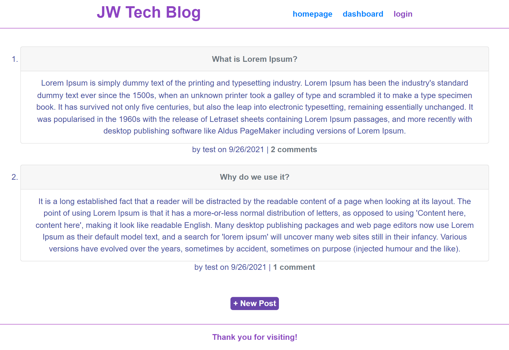

# Tech Blog

## Description
  
This is to build a CMS-style blog site similar to a Wordpress site, where developers can publish their blog posts and comment on other developers’ posts as well. This site is built completely from scratch and deploy it to Heroku. The app will follow the MVC paradigm in its architectural structure, using Handlebars.js as the templating language, Sequelize as the ORM, and the express-session npm package for authentication.

  ## Table of Contents
  - [Description](#description)
  - [Installation](#installation)
  - [Usage](#usage)
  - [License](#license)
  - [Credits](#credits)
  ## Installation
  `npm init`
  `npm i bcrypt connect-session-sequelize dotenv express express-handlebars express-session mysql2 sequelize`

  ## Usage
  Run `node server.js` or `npm start` command at the root of the file to connect to the MySQL database on server start.

  Below is a screenshot of the application: 

   
  
  ## License
  This application is covered by [MIT](https://opensource.org/licenses/MIT) license. 
  
  ## Credits: 
  https://courses.bootcampspot.com/